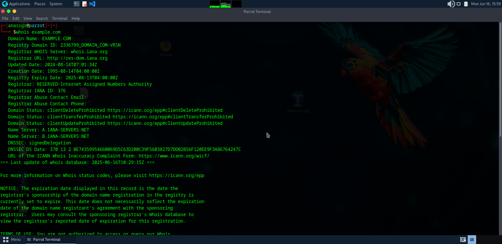

# whois-harvester-recon
Passive reconnaissance project using whois and theHarvester for CEH learning
=======

>>>>>>> 8b877b2 (Added screenshot for Whois scan)
 
# whois-harvester-recon 🕵️‍♂️

A simple, practical reconnaissance project for CEH learners, using `whois` and `theHarvester` to gather domain info and potential attack surfaces.

---

## 🛠 Tools Used
- Parrot OS
- `whois`
- `theHarvester`
- GitHub for documentation and sharing

---

## 📌 Objectives

- Understand passive reconnaissance
- Identify domain registration details
- Discover emails, subdomains, and hosts using `theHarvester`
- Document and present findings like a professional

---

## 🔍 Step 1: Whois Lookup

### Command:
```bash
whois example.com
